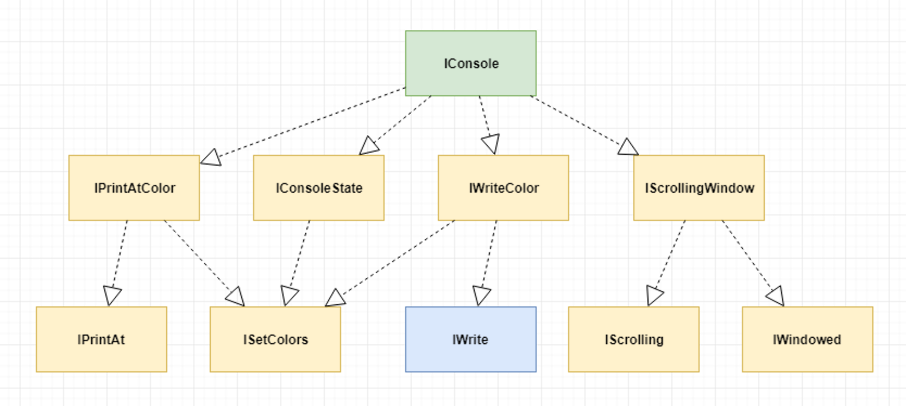

# IConsole

## Draft for discussion proposal, call for review

[](https://www.nuget.org/packages/IConsole/) 
[](https://opensource.org/licenses/MIT) 
[](https://gitter.im/goblinfactory-konsole/community?utm_source=badge&utm_medium=badge&utm_campaign=pr-badge&utm_content=badge)

.NET `System.Console` abstraction. Use to remove a direct dependancy on `System.Console` and replace with a dependancy on a well used and well known console interface, `IConsole`, to allow for building rich 'testable', high quality interactive console applications and utilities.

As used by [`Goblinfactory.Konsole`](https://github.com/goblinfactory/konsole). (https://github.com/goblinfactory/konsole) The home of `ProgressBar`, `Window`, `Form` and `Drawing`.

If you have any questions about how to use this package, please join the discussion on our gitter group at : https://gitter.im/goblinfactory-konsole/community

## But I can write my own System.Console wrapper, it will be done in less than 40 lines? 

It's not about writing a wrapper, that is very easy. It's about setting a standard of interoperability between everyone that uses this as their interface. Since you would have started by writing your own interface, and then also writing something that implements that interface, why not save yourself the 2 or 3 hours you will be sidetracked doing that and dive right in to cleaning up your code.

You can use `IConsole` as simply as typing, `add package IConsole`. You can always come back later and remove it. 

## IConsole

This is the sum of all interfaces. It will require the most work to implement. Typically you often only need `IWrite` and-or  `IPrintAt` or `IPrintAtColor`

```csharp
 public interface IConsole : IPrintAtColor, IConsoleState, IWriteColor, IScrollingWindow { }
```



## IWrite vs IConsole

If the app you are refactoring does not set the cursor position, and merely "writes" out via `System.Console` then use the `IWrite` interface as your dependancy. IWrite is good enough for 99% of `System.Console` refactorings, where you're essentially just logging stuff to the console. 

## Project Status

- **The project is in currently only at alpha concept stage** (i.e. pre-beta and inviting discussion before it get's released as official version 1.0), meaning that the final interface contracts are still being finalised and may change with the final version. The ink on this project is still only a few days wet. I have not yet migrated `Goblinfactory.Konsole` over to using the new contracts yet. As soon as that's done I'll release the first version `1.0.0-alpha` do some testing, and then remove the alpha status. 

## How to use IConsole?

Pick the narrowest set of features that the class that you are refactoring depends on. 

Logging, printing only? `IWrite`, Needs to print in color? `IWriteColor`, Need to change the cursor position when printing? `IPrintAt`, eed to scroll portions of the screen? `IScrolling`, Need all of the above? `IConsole`.

Need only 2, e.g. printing only (no color) and printing at? Then use interface inheritance and implement just the bits you need. For example. 

```csharp

public interface IPrint : IWrite, IPrintAt { }

public class MyClass {
    public MyClass(IPrint print) { ...}
    ...
    _print.PrintAt(0, 60, $"Total {total}");
}
```

# Interfaces

## IWrite

Typically use for Logging and printing only. Nothing fancy, just writing something out the console or the build output.

- `void WriteLine(string format, params object[] args);`
- `void WriteLine(string text);`
- `void Write(string format, params object[] args);`
- `void Write(string text);`
- `void Clear();`

## ISetColors

Change the foreground and background color of what will get printed with the next Write, or WriteLine command.

- `ConsoleColor ForegroundColor { get; set; }`
- `ConsoleColor BackgroundColor { get; set; }`
- `Colors Colors { get; set; }`

## Colors (class, not interface!)

The eagle eyed amongst you will have spotted the single class file in this contract. Being able to specify the colors for something with a single assignment makes a lot of code easier to read. 

```csharp
myFoo.ForeGroundColor = System.ConsoleColor.Red;
myFoo.BackgroundColor = System.ConsoleColor.White;

vs

myFoo.Colors = MyStaticThemes.Default;
```
also, if you're writing Threadsafe code, then you'll be saving and restoring colors a lot.

```csharp
  lock(_staticLocker)
  {
    try
    {
      var currentColors = myFoo.Colors;
      myFoo.Colors = MyTheme.Highlighted;
      myFoo.WriteLine("I am highlighted item");
    }
    finally
    {
        myFoo.Colors = currentColors;
    }
  }
}
```
In fact, the pattern above is such a common pattern that the interface `IConsoleState` includes a dedicated method just for your implementation of that threadsafe pattern `void DoCommand(IConsole console, Action action);` the above code then becomes
```csharp
  myFoo.DoCommand(()=> {
    MyFoo.Colors = MyTheme.Highlited;
    myFoo.WriteLine("I am highlighted");
  );
```

#### Setting Colors

Set the foreground and background color in a single threadsafe way. i.e. locks using a static locker before setting the individual ForegroundColor and BackgroundColor properties. Colors is a syntactic shortcut for getting or setting both the Foreground and Background color in a single assignment. For example

calling 
```
console.Colors = new Colors(Red, White);
```
must be implemented such that it is the same as having called 
```
console.ForegroundColor = Red; 
console.BackgroundColor = White;
```

## IWriteColor 

`public interface IWriteColor : ISetColors`

If you need to print in color. 

- `void Write(ConsoleColor color, string format, params object[] args);`
- `void Write(ConsoleColor color, string text);`
- `void WriteLine(ConsoleColor color, string format, params object[] args);`
- `void WriteLine(ConsoleColor color, string text);`
- `void Clear(ConsoleColor? backgroundColor);`

## IPrintAt

Interface for a class that needs to print at a specific location in a window. 

- `void PrintAt(int x, int y, string format, params object[] args);`
- `void PrintAt(int x, int y, string text);`
- `void PrintAt(int x, int y, char c);`
- `int WindowWidth { get; }`
- `int WindowHeight { get; }`

## IPrintAtColor

- `void PrintAtColor(ConsoleColor foreground, int x, int y, string text, ConsoleColor? background);`

## IScrolling

Interface for a class that needs to be able to scroll portions of the screen. This will most likely cause your library to require platform specific implementations for scrolling.

- `void MoveBufferArea(int sourceLeft, int sourceTop, int sourceWidth, int sourceHeight, int targetLeft, int targetTop, char sourceChar, ConsoleColor sourceForeColor, ConsoleColor sourceBackColor);`
- `void ScrollDown();`

## IWindowed

If you are writing a windowing library like `Konsole` then each window region needs to report back an AbsoluteX and AbsoluteY position so that printing can happen at the correct (relative) position on the real console.

- `int AbsoluteX { get; }`
- `int AbsoluteY { get; }`

## IConsoleState

Interface for all the console methods that are most at risk of causing corruptions in multithreaded programs. The way to protect against corruption is to manage locking and manually save and restore state.

- `ConsoleState State { get; set; }`
- `int CursorTop { get; set; }`
- `int CursorLeft { get; set; }`
- `void DoCommand(IConsole console, Action action);`
- `ConsoleColor ForegroundColor { get; set; }`
- `ConsoleColor BackgroundColor { get; set; }`
- `bool CursorVisible { get; set; }`

#### DoCommand

`void DoCommand(IConsole console, Action action)`

Runs an action that may or may not modify the console state that can cause corruptions when thread context swaps. Must lock on a static locker, do try catch, and ensure state is back to what it was before the command ran. If you're not writing a threadsafe control or threading is not an issue, then you can simply call `action()` in your implementation.

example implementation;

```csharp
  lock(_locker)
  {
    var state = console.State;
    try
    {
      action();
    }
    finally
    {
      console.State = state;</code>
    }
  }
```

## Getting Started

1. Find code that writes to the `System.Console` directly. Do a grep search for `Console.*` to get started.

```csharp
public class Accounts
{
  ... some code here

  // methods below writes to the console

  public void DoSomethingWithInvoice(Invoice inv) {
      ... some code
      Console.WriteLine($"Invoice #{inv.Number}, Date: {inv.Date} Amount:{inv.Amount}");
      ...
  }
}

```

2. Install `IConsole` package

> install-package IConsole

3. Create your own live and  test stubb, Mock or fake that implements `IConsole`.
4. Refactor your code to use the  `IConsole` abstraction. `IConsole` uses `Konsole` as the parent namespace. 


```csharp

using Konsole; 

public class Accounts
{
  ... some code here
  private IConsole _console;
  public Accounts(IConsole console) {
      _console = console;
  }
  // change all writes to System.Console to use the injected IConsole
  
  public void DoSomethingWithInvoice(Invoice inv) {
      ... some code
      _console_.WriteLine($"Invoice #{inv.Number}, Date: {inv.Date} Amount:{inv.Amount}");
      ...
  }
}
```

5. now you can test your class


```csharp

using Konsole; 

    [Test]
    public void doing_something_to_invoices_must_print_the_invoice_details_to_the_console()
    {
        IConsole console = new MockConsole();
        var accounts = new Accounts(console);
        accounts.DoSomethingWithInvoice(TestData.MyTestInvoice1);

        // confirm the display is what you expected

        var expected = "Invoice #101, Date:21st February 2020, Amount:£ 1234.56";
        
        console.Buffer.Should().BeEquivalentTo(expected);
    }

```


## Pre-built battle hardened thread safe implementations for production and testing uses

Please take a look at [`Goblinfactory.Konsole`](https://github.com/goblinfactory/konsole) https://github.com/goblinfactory/konsole project which has pre-built

- `ConcurrentWriter() : IConsole`
- `NullWriter() : IConsole` 
- `Window() : IConsole`
- `MockConsole() : IConsole` 

* https://github.com/goblinfactory/konsole

.. as well as a full suite of Console library utilities, Box, Forms, ProgressBar, Windows and more that are all `IConsole` compatible.

**NB! `IConsole` is being lifted out from `Goblinfactory.Konsole` so as of today (14 Jan 2020) it technically does not yet implement the interface, but will, within a day or two as soon as version `1.0` is released via nuget.org.

## Other libraries using IConsole

- To add your library here, [chat with me on gitter](https://gitter.im/goblinfactory-konsole/community).


enjoy

Alan Hemmings